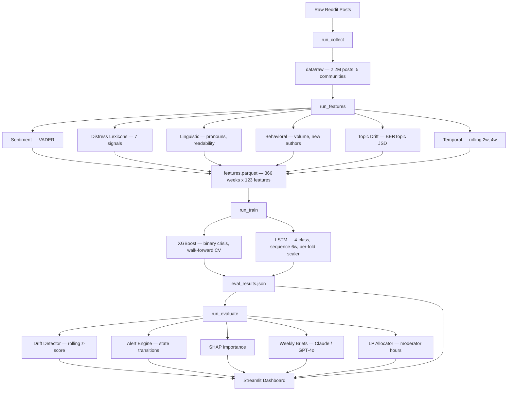

# Community Mental Health Crisis Predictor

> A production-style early-warning pipeline that detects community-level mental health distress signals on Reddit — up to **14 weeks before they peak** — using walk-forward backtesting on 7 years of real data.

**Live dashboard →** https://community-crisis-predictor-mozt6amaceenfxso6pegb8.streamlit.app/

---

## What This Is

Mental health crises don't happen to individuals in isolation — they ripple through communities. When economic anxiety spikes, when a public tragedy occurs, when seasonal patterns shift, subreddits like r/depression and r/SuicideWatch show measurable, detectable changes in language *before* the crisis peak.

This system treats each subreddit as a **community-level signal** — like a weather station for collective distress. It ingests 7 years of real Reddit posts (2018–2024), extracts weekly behavioral and linguistic features, and trains two models to forecast whether the community's aggregate distress will escalate **next week** — and how severe it will be.

The result is a four-state escalation forecast, a moderator resource allocator, drift monitoring with tiered alerts, and a live replay dashboard — all deployed and running on real data.

---

## Is It "Live"?

Yes — in the most meaningful sense for a production-style system:

- **Live drift detection**: the monitoring module runs rolling z-scores over real weekly aggregates and fires tiered alerts when signals deviate from baseline. That is a real-time-style detection loop, run in batch.
- **Live pipeline**: collect → features → train → evaluate → monitor is a full end-to-end pipeline on real archived Reddit data, not a toy demo.
- **Live predictions**: the dashboard replays walk-forward predictions week by week, showing what the model *would have predicted in real time* had it been deployed.

The honest framing: *"a production-style pipeline with live-equivalent drift monitoring and walk-forward backtesting on real Reddit data"* — rather than claiming it polls Reddit in real-time (it uses the archived Zenodo + Arctic Shift dataset). That distinction does not undercut the work.

---

## Key Results (Clean Run — 366 weeks, 2018–2024)

| Subreddit | XGB PR-AUC | XGB Recall | LSTM PR-AUC | Lead Time |
|-----------|-----------|-----------|------------|-----------|
| r/lonely | **0.889** | 0.986 | 0.852 | — |
| r/mentalhealth | **0.869** | 0.976 | 0.794 | — |
| r/suicidewatch | **0.855** | 0.856 | 0.697 | **12.6 weeks** |
| r/anxiety | **0.758** | 0.852 | 0.642 | **14.8 weeks** |
| r/depression | 0.449 | 0.706 | 0.227 | 4.6 weeks |

> PR-AUC is the primary metric for this imbalanced detection task (baseline = community crisis rate, ~12%). Walk-forward CV with 1-week gap — no future data ever seen during training.

---

## Architecture



---

## The Four-State Model

Each week, the labeler asks: *what state will this community be in next week?*

| State | Name | Threshold | Meaning |
|-------|------|-----------|---------|
| 0 | Stable | < 0.3σ above baseline | Community distress within normal range |
| 1 | Early Vulnerability | 0.3σ – 0.6σ | Early warning — language shifts beginning |
| 2 | Elevated Distress | 0.6σ – 1.0σ | Significant distress increase, closer monitoring needed |
| 3 | Severe Community Distress | > 1.0σ | Sustained or extreme community-wide signal |

Thresholds are fit **per community per training fold** using the fold's distress score distribution — so r/SuicideWatch's "normal" is different from r/lonely's. Labels are `shift(-1)`: the label for week T is the state of week T+1, because the task is to predict *next* week.

---

## Pipeline Stages

### 1. Collect — `run_collect`

Ingests from two sources, merged per subreddit:

- **Zenodo (2018–2020)**: Low et al. COVID mental health Reddit dataset. Downloads only subreddit-matched CSV files (~selective, not 3.1 GB bulk).
- **Arctic Shift (2021–2024)**: JSONL gap-fill fetched from Google Drive. Searched recursively across nested extraction folders.

Both sources write to canonical raw schema: `post_id`, `created_utc`, `selftext`, `subreddit`, `author_hash`, `data_source`. Collection is idempotent — re-running skips already-ingested sources via manifest.

### 2. Features — `run_features`

Aggregates posts into weekly bins and extracts 123 features across six families:

| Family | Features |
|--------|----------|
| **Sentiment** | VADER: avg_negative, avg_positive, avg_neutral, pct_negative, pct_positive |
| **Distress lexicons** | Hopelessness, help-seeking, suicidality, isolation, economic stress, domestic stress — all as per-word density |
| **Linguistic** | First-person singular ratio, Flesch-Kincaid, avg sentence length, question ratio |
| **Behavioral** | Post volume, unique posters, new author rate, engagement delta |
| **Topic drift** | BERTopic-based Jensen-Shannon divergence vs previous week (1w) and 4 weeks ago (4w) |
| **Temporal** | Rolling means at 2-week and 4-week windows for all signals |

All distress signals use **per-word density** (matches/total words) so high-volume weeks don't inflate the score.

### 3. Label — `run_train` (labeling step)

`CrisisLabeler.fit()` computes the mean and std of the distress score **on the training window only** per fold. Four state thresholds are derived from the community's own baseline — no cross-community contamination.

The composite distress score weights 7 signals: `neg_sentiment (0.25) + hopelessness (0.20) + suicidality (0.20) + help_seeking (0.15) + isolation (0.10) + economic_stress (0.05) + domestic_stress (0.05)`. Weights are renormalized if any signal column is absent.

### 4. Train — `run_train`

Two models are trained side by side on the same walk-forward splits:

**XGBoost (baseline)**
- Binary classifier: crisis (state ≥ 2) vs non-crisis
- `RandomizedSearchCV` with `TimeSeriesSplit(n_splits=3, gap=1)` — gap prevents the shifted label from leaking first-validation-week information into hyperparameter selection
- `scoring="average_precision"` — aligns inner CV objective with PR-AUC evaluation metric
- `scale_pos_weight` auto-computed per fold to handle class imbalance (capped at 8×)

**LSTM (primary)**
- 4-class PyTorch sequence model: `LSTMNet(input → LSTM → Dropout → Linear(4))`
- Sliding window of 6 weeks as input context
- `MinMaxScaler` fit on training window, applied at prediction time — no leakage
- Walk-forward: expanding training window, 1-week gap, minimum 26-week train window

Walk-forward evaluation: each fold trains on all past data, predicts the next week. Folds expand one week at a time. Reported metrics aggregate across all folds.

### 5. Monitor — `run_evaluate`

**Drift Detector** — for each week, computes z-scores for 4 signals against a 12-week rolling baseline:
- `avg_negative`, `hopelessness_density`, `topic_shift_jsd`, `topic_shift_jsd_4w`
- Alert levels: Normal (|z| < 1σ) → Warning (1–2σ) → Alert (2–3σ) → Critical (> 3σ)
- Uses `max(|z|)` across signals — catches both spikes **and** sudden drops

**Alert Engine** — logs every state change (escalation or de-escalation) with week, subreddit, distress score, and dominant signal. Duplicate guard prevents re-logging on pipeline reruns.

**LP Allocator** — formulates a linear programme to distribute a fixed weekly moderator-hour budget across subreddits. Objective: maximise `Σ p[i] × effectiveness[i] × hours[i]`. Probabilities are smoothed using a 4-week rolling mean to reduce single-week noise.

**Weekly Briefs** — for each predicted week, builds a structured JSON context (SHAP top features + week-over-week deltas + retrieved playbook text) and sends to Claude → GPT-4o → template fallback. Output stored in `weekly_briefs.json` per subreddit.

### 6. Dashboard — Streamlit

The app is **multipage** (Streamlit `pages/`). Entry point remains `src/dashboard/app.py` for Streamlit Cloud.

| Page | Purpose |
|------|---------|
| **app** (sidebar label) | Full **analyst dashboard**: all-community cards, week replay, tabs (drift, SHAP, quality, metrics, allocation), model dropdown. |
| **Community Copilot** (`pages/2_End_User_Summary.py`) | **Moderator triage**: 50/50 two-column layout — ranked community table (rank, community, signal, p(hi), trend, **Open**) and live detail + **AI Copilot** on the right (`POST /brief` on the API; keys on the server only). Full-width “Responsible use” below. Sidebar links back to **app** (analyst home). |

**Analyst dashboard (`app`)** highlights:

- **All-community card row**: state badge, distress score, p(distress), 15-week sparkline
- **Week slider**: replay any week from 2018 to 2024, all communities in sync
- **Timeline**: distress score + walk-forward predictions + threshold bands + COVID marker
- **Weekly snapshot panel**: summary, key signals, recommended action
- **Tabs**: Drift alerts / Feature importance (SHAP) / Data quality / Recommended actions / Alert feed
- **Model performance panel**: Recall, Precision, F1, PR-AUC + 4-class confusion matrix + Decision usefulness (Recall@K)
- **Moderator allocation**: LP output with sensitivity analysis across budget scenarios

---

## Data

| Source | Period | Posts | Coverage |
|--------|--------|-------|----------|
| Zenodo (Low et al.) | 2018 – 2020 | ~800K | Pre/during COVID |
| Arctic Shift gap-fill v1 | 2018 mid / 2020 mid | ~200K | Missing Zenodo windows |
| Arctic Shift gap-fill v2 | 2021 – 2024 | ~1.2M | Post-COVID extension |
| **Total** | **2018 – 2024** | **~2.2M** | **366 weeks** |

5 subreddits: r/depression, r/anxiety, r/mentalhealth, r/SuicideWatch, r/lonely

**Privacy**: author usernames are hashed with a per-deployment salt before storage. URLs and email addresses are stripped at collection time. No individual-level predictions are made or stored — all analysis is at the aggregate community level.

---

## Quick Start

```bash
# 1. Clone and install
git clone https://github.com/jainaryan/community-crisis-predictor
cd community-crisis-predictor
python -m venv venv
source venv/bin/activate        # Linux/macOS
# venv\Scripts\activate         # Windows
pip install -e ".[dev]"

# 2. Run full pipeline (synthetic, no API keys needed)
python -m src.pipeline.run_all \
  --config config/default.yaml \
  --synthetic --skip-topics --skip-search --force

# 3. Launch dashboard
streamlit run src/dashboard/app.py
```

For real data (Zenodo + Arctic Shift — no credentials required):

```bash
python -m src.pipeline.run_all --config config/default.yaml --force
```

For LLM weekly briefs, set in `.env`:
```
ANTHROPIC_API_KEY=...    # preferred
OPENAI_API_KEY=...       # fallback
```
If neither is set, briefs are generated from a template — the rest of the pipeline is unaffected.

---

## Project Structure

```
src/
├── collector/
│   ├── zenodo_loader.py          Zenodo CSV downloader — selective by subreddit/timeframe
│   ├── arctic_shift_loader.py    Arctic Shift JSONL ingest — recursive nested folder search
│   ├── historical_loader.py      PullPush.io (PushShift) API client
│   ├── reddit_client.py          PRAW fallback collector
│   ├── synthetic.py              Synthetic data generator for testing
│   ├── manifest.py               Idempotent ingest tracking
│   ├── privacy.py                PII stripping (hash authors, strip URLs)
│   └── storage.py                Parquet read/write helpers
├── processing/
│   ├── text_cleaner.py           URL removal, lowercasing, deleted-post filtering
│   └── weekly_aggregator.py     Group posts into ISO week bins
├── features/
│   ├── sentiment.py              VADER distributions (parallel workers)
│   ├── distress.py               7-signal lexicon density extraction (per-word)
│   ├── linguistic.py             Pronoun ratios, readability, sentence stats
│   ├── behavioral.py             Post volume, engagement, new author rate
│   ├── topics.py                 BERTopic + JSD topic drift (1w and 4w)
│   └── temporal.py              Rolling averages at 2w and 4w
├── labeling/
│   ├── distress_score.py         Weighted composite score — renormalizes missing weights
│   └── target.py                 CrisisLabeler — 4-class with per-fold community baseline
├── modeling/
│   ├── train_xgb.py              XGBoost binary baseline — gap=1, scoring=average_precision
│   ├── train_rnn.py              PyTorch LSTM — 4-class, MinMaxScaler per fold
│   ├── evaluate.py               Walk-forward evaluation (XGB + LSTM)
│   ├── splits.py                 WalkForwardSplitter — expanding window, 1-week gap
│   ├── calibration.py            Platt / isotonic probability calibration
│   ├── explain.py                SHAP importance via TreeExplainer
│   └── lead_time.py             Consecutive backward streak lead-time metric
├── monitoring/
│   ├── drift_detector.py         Rolling z-score · abs(z) · 4 signals · 3 alert levels
│   └── alert_engine.py           State transition logger · dupe guard · de-escalation tracking
├── prescriptive/
│   └── lp_allocator.py          Moderator allocation LP · scipy linprog · 4-week prob smoothing
├── reporting/
│   └── eda.py                   IQR outlier detection · trend · crisis rate by year · HTML
├── narration/
│   └── narrative_generator.py   Weekly brief — SHAP context + playbook RAG + LLM/template
├── visualization/
│   ├── timeline.py              4-color Plotly backtesting timeline
│   ├── feature_importance.py    SHAP bar chart
│   └── dashboard.py            Combined HTML report
├── dashboard/
│   ├── app.py                   Streamlit entrypoint (sidebar nav shows as **app**)
│   ├── pages/                   Multipage: Community Copilot (`2_End_User_Summary.py`)
│   ├── data_access.py           Cached loaders (features / eval / reports)
│   ├── state.py                 Ensemble merge · model picker · monitoring mode
│   ├── components.py            Drift table · metrics panel · alert feed
│   └── charts.py                Sparkline · SHAP bar chart builders
├── core/
│   ├── domain_config.py         Canonical state names and threshold labels
│   └── ui_config.py             Colors, badges, chart labels, all UI/report copy
└── pipeline/
    ├── run_collect.py
    ├── run_features.py
    ├── run_train.py
    ├── run_evaluate.py
    └── run_all.py               Chains all stages; --synthetic, --skip-topics, --force flags

serving/                         FastAPI inference service (Render.com)
├── main.py                      /health /predict /brief /model-info /logs/summary
├── requirements.txt             Includes python-dotenv; `pip install -r` before local uvicorn
config/
├── default.yaml                 All pipeline settings
├── lexicons/                    7 distress lexicon files (hopelessness, suicidality, etc.)
└── intervention_playbook.md     Retrieval source for weekly brief context
```

---

## Evaluation Design

**Why walk-forward cross-validation?**

Standard k-fold CV would let the model train on future weeks to predict past ones — catastrophic for time series. Walk-forward CV ensures every prediction is made on data the model has never seen:

```
Fold 1: train [weeks 1..26] → predict week 28   (gap=1)
Fold 2: train [weeks 1..27] → predict week 29
...
Fold N: train [weeks 1..339] → predict week 341
```

Each fold's labeler is fit only on the training window. Each fold's LSTM scaler is fit only on the training features. No future information ever enters the training path.

**Why PR-AUC over ROC-AUC?**

Crisis weeks are rare (~12% of all weeks). ROC-AUC is optimistic on imbalanced data — a model predicting "never crisis" scores ROC-AUC ≈ 0.88. PR-AUC is harder: its random baseline equals the crisis rate (~0.12), making genuine model skill clearly visible.

**Why recall over precision for deployment?**

Missing a genuine crisis week (False Negative) means no moderator intervention in a community that needed it. A false alarm (False Positive) means moderators are deployed unnecessarily — costly but not harmful. This asymmetry justifies optimizing for recall at inference time via a low decision threshold (0.3), while still training with `average_precision` scoring to maintain a calibrated signal.

---

## Temporal Leakage Controls

| Risk | Mitigation |
|------|-----------|
| Future data in training features | Walk-forward split: train fold never includes validation weeks |
| Future data in distress score normalization | `CrisisLabeler.fit()` called per fold on training window only |
| Future data in LSTM feature scaling | `MinMaxScaler` fit on training window, applied at predict time |
| XGB inner CV leakage (shifted labels) | `TimeSeriesSplit(gap=1)` drops boundary sample from inner validation |
| BERTopic soft leakage | Run with `--skip-topics` for fully clean evaluation |
| SHAP feature selection cycle | `feature_selection.enabled: false` for clean runs |
| LSTM architecture search | `search.enabled: false` — prevents nested CV hyperparameter leakage |

---

## Configuration

Key settings in `config/default.yaml`:

```yaml
collection:
  source: "zenodo_covid"          # zenodo_covid | reddit_api | synthetic

labeling:
  crisis_thresholds_std: [0.3, 0.6, 1.0]   # sigma cutoffs for 4 states

modeling:
  xgboost:
    scale_pos_weight: "auto"
    n_search_iter: 30
  lstm:
    sequence_length: 6
    hidden_size: 32
    walk_forward_epochs: 20       # faster during CV, full epochs for final model
  feature_selection:
    enabled: false                # disable for clean leakage-free runs
  walk_forward:
    min_train_weeks: 26
    gap_weeks: 1

evaluation:
  primary_metric: "recall"
  probability_threshold: 0.3     # low threshold → high recall at inference time

prescriptive:
  total_moderator_hours: 10.0
  sensitivity_budgets: [5, 6, 7, 8, 9, 10, 12, 14, 16, 18, 20]
```

---

## Deployment

| Service | Platform | URL |
|---------|----------|-----|
| Streamlit dashboard | Streamlit Cloud | https://community-crisis-predictor-mozt6amaceenfxso6pegb8.streamlit.app/ |
| FastAPI inference API | Render.com | https://community-crisis-predictor.onrender.com |

Set **`ANTHROPIC_API_KEY`** (or **`OPENAI_API_KEY`**) in the Render service **Environment** so **`POST /brief`** (Community Copilot) uses a real LLM; `.env` is not deployed. Verify with **`GET /health`** → `llm_keys`. See **`serving/README.md`** for full API setup.

```bash
# Local dashboard
streamlit run src/dashboard/app.py

# Local API (loads repo-root or serving/.env for /brief — see serving/README.md)
cd serving && uvicorn main:app --reload --port 8000

# Full clean pipeline run (what the cluster uses)
python -m src.pipeline.run_all \
  --config config/default.yaml \
  --skip-topics --force
```

### API Endpoints

| Endpoint | Method | Description |
|----------|--------|-------------|
| `/health` | GET | Service status, loaded models, `llm_keys` / `dotenv_file` for Copilot debugging |
| `/predict` | POST | XGB + LSTM inference, drift warnings |
| `/brief` | POST | AI Copilot plain-language brief (LLM on server; template if no API key) |
| `/model-info` | GET | Walk-forward metrics + top SHAP features |
| `/logs/summary` | GET | Aggregate prediction log statistics |
| `/docs` | GET | Swagger UI |

---

## Tests

```bash
python -m pytest tests/ -v              # 87 tests — pipeline, dashboard helpers, narration, etc.
python -m pytest serving/tests/ -v     # 35 tests — FastAPI (/health, /predict, /brief, …)
```

Tests cover: Arctic Shift loader, Zenodo loader, manifest idempotency, privacy/PII stripping, sentiment extraction, distress lexicon scoring, walk-forward splits (no overlap, gap, min-train), calibration, decision usefulness, lead time, drift detector (all alert levels + de-escalation), narrative generation, dashboard ensemble state helpers, text cleaning, and weekly aggregation.

---

## Team

IS5126 — Hands-on with Data Science · NUS School of Computing · AY2025/26
